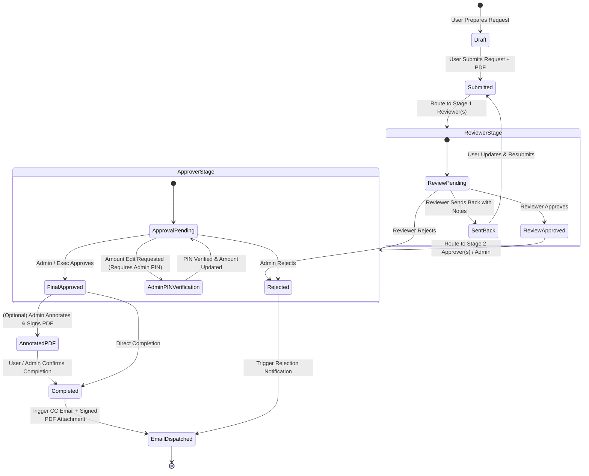

# SaaS Web App - Request Submission & Approval Platform

[](https://flask.palletsprojects.com/)
[](https://flutter.dev/)
[](https://www.mysql.com/)
[](#security--authentication-model)
[](LICENSE)

**SaaS Web App (FinalWebAPP)** is an enterprise-grade multi-tier request submission, workflow routing, approval management, and PDF digital signature platform. It features a robust Python/Flask backend, responsive web dashboards tailored for multiple organizational roles (User, Reviewer/Dean, Admin, SuperAdmin, GSD, IT), an interactive web-based PDF annotation system, and a cross-platform Flutter mobile client.

---

## 📋 Table of Contents
1. [System Architecture & Component Relationships](#-system-architecture--component-relationships)
2. [Component Breakdown](#-component-breakdown)
3. [Request Workflow & State Machine](#-request-workflow--state-machine)
4. [Security & Authentication Model](#-security--authentication-model)
5. [Repository Directory Structure](#-repository-directory-structure)
6. [Prerequisites & Environment Setup](#-prerequisites--environment-setup)
7. [Running the Application](#-running-the-application)
8. [Backend API Reference](#-backend-api-reference)
9. [Automated Testing & Load Testing](#-automated-testing--load-testing)
10. [License](#-license)

---

## 🏗️ System Architecture & Component Relationships

The platform is designed around a centralized, asynchronous Flask REST & Web Application core that serves web clients via session-authenticated Jinja2 views, mobile clients via bearer token JSON APIs, and communicates with a relational MySQL database, an SMTP server, and a PDF annotation engine.

### High-Level Architecture Diagram

```mermaid
graph TD
    %% User Interfaces
    subgraph Frontend Tier
        WEB["🌐 Jinja2 Web Dashboards\n(User, Dean, Admin, GSD, IT)"]
        MOB["📱 Flutter Mobile App\n(moble/app - Android/iOS/Web)"]
        ANNOTATOR["✍️ Interactive PDF Annotator\n(annotate.html + pdf.min.js)"]
    end

    %% Application Server
    subgraph Application Tier (Flask Engine)
        MAIN["⚡ main.py\n(Flask Core, Middleware, Routers, Security)"]
        CFG["⚙️ config.py\n(Env Loader & DB Pool)"]
        OTP["✉️ sendotp.py\n(OTP Service & SMTP Mailer)"]
    end

    %% Persistence & Services
    subgraph Data & External Services
        DB[("🛢️ MySQL Database\n(users, requests, workflows, logs)")]
        SMTP["📧 SMTP Server\n(Email Notifications & OTP)"]
        FS["📁 File Storage\n(Uploaded Attachments & Signed PDFs)"]
    end

    %% Relationships
    WEB -->|Session Cookies & CSRF| MAIN
    MOB -->|Bearer Token & REST API| MAIN
    ANNOTATOR -->|Annotation JSON / Canvas| MAIN
    MAIN --> CFG
    CFG --> DB
    MAIN --> OTP
    OTP -->|Sends Emails / OTPs| SMTP
    MAIN -->|Reads / Writes Data| DB
    MAIN -->|Store & Stamp PDFs| FS
```

### Component Relationship Matrix

| Component | Connected To | Communication Protocol / Interface | Responsibility / Interaction |
| :--- | :--- | :--- | :--- |
| **Flask Backend (`main.py`)** | MySQL DB, Web Client, Mobile Client, SMTP, PDF Engine | HTTP/HTTPS REST, Jinja2, SQL, SMTP | Central controller: handles authentication, role routing, request lifecycle, PIN checks, PDF signature stamping, and activity logging. |
| **Web Frontend (`templates/` & `static/`)** | Flask Backend (`main.py`) | HTML5, JavaScript (Fetch API), Jinja2 templates, CSS3 | Role-specific dashboards for Users, Deans/Reviewers, Admins, GSD, and IT personnel with live filter tables, status toasts, and modal forms. |
| **Flutter Mobile App (`moble/app/`)** | Flask Backend (`/api/mobile/*`) | JSON over HTTP/HTTPS, Bearer Token Auth | Mobile client for standard users to register with OTP, submit requests, view real-time status updates, check notifications, and track activity logs. |
| **MySQL Database (`config.py`)** | Flask Backend (`main.py`) | `mysql-connector-python` DB Driver | Relational storage for users, request records, multi-level reviewer/approver routing tables, audit trails (`activity_logs`), notifications, and OTP codes. |
| **OTP & Email Engine (`sendotp.py`)** | Flask Backend, SMTP Server | SMTP Protocol (TLS/SSL) | Sends 6-digit verification codes for signup and sensitive Admin PIN operations, and dispatches automated status updates and CC email notifications with signed PDF attachments. |
| **PDF Annotation Engine (`annotate.html`)** | Flask Backend (`/api/request/<id>/annotate`) | HTML5 Canvas, PDF.js, PyMuPDF / ReportLab | Enables reviewers/admins to visually annotate, highlight, draw signatures on PDF attachments, and generate tamper-sealed signed PDFs. |

---

## 🧩 Component Breakdown

### 1. Flask Backend Engine (`main.py`, `config.py`, `sendotp.py`)
- **`main.py`**: Monolithic Flask server housing security headers, rate limiting (Flask-Limiter), authentication blueprints, role permission guards, request submission routes, multi-stage approval logic, admin PIN verification, signed PDF processing, and mobile API endpoints.
- **`config.py`**: Manages environment variables and creates MySQL database connections via `get_connection()`.
- **`sendotp.py`**: Handles OTP generation, cooldown enforcement, expiration checking, and transactional email dispatches.

### 2. Multi-Role Web Dashboards (`templates/` & `static/`)
- **User Dashboard (`templates/user.html`, `static/user/user.js`)**: Enables end-users to submit new requests with attachments, view request progress, receive notifications, and verify completion.
- **Dean / Reviewer Dashboard (`templates/dean.html`, `static/dean/dean.js`)**: Allows deans and department reviewers to review incoming request queues, approve, reject, or send back requests with comments.
- **Admin & Executive Dashboard (`templates/admin.html`, `static/admin/admin.js`)**: SuperAdmin/Admin command center for high-value request approvals, PIN-protected amount modifications, CC dispatches, workflow management, and report generation with Chart.js.
- **GSD Dashboard (`templates/gsddashboard.html`, `static/gsd/gsd.js`)**: General Services Division view for tracking item copies, shipping logistics, and material distribution.
- **IT Administration (`templates/IT.html`, `static/IT.css`)**: System administration portal for user account creation, department/position management, and system-wide metric tracking.

### 3. PDF Annotation & Signature Subsystem (`templates/annotate.html`)
- Allows reviewers to open uploaded PDF attachments in a web-based canvas viewer powered by PDF.js.
- Supports digital drawing signatures, text annotations, and approval stamps.
- Merges annotation vectors into original PDFs on the server to produce signed, audit-ready PDF documents.

### 4. Cross-Platform Flutter Mobile Client (`moble/app/`)
- **`lib/main.dart`**: Entry point with session gating and token verification.
- **`lib/login_page.dart`**: Mobile login, signup, and mobile OTP verification UI.
- **`lib/api_service.dart`**: Platform-aware HTTP client interfacing with backend `/api/mobile/*` endpoints.
- **`lib/homepage.dart`**: Navigation shell featuring Dashboard, Notifications, and Settings tabs.

---

## 🔄 Request Workflow & State Machine

Requests undergo a strict multi-tier review and approval lifecycle before final completion:



---

## 🔒 Security & Authentication Model

1. **Authentication Schemes**:
   - **Web**: HTTP-Only, SameSite, Secure session cookies with CSRF tokens on all POST requests.
   - **Mobile**: Bearer Token-based authentication saved in encrypted device storage (`shared_preferences`).
2. **Password Security**: Argon2id password hashing with custom salt, parameter tuning, and automatic re-hashing on login.
3. **Admin PIN Security**: High-value request amount edits require 2-Factor verification via an Admin PIN and email OTP fallback.
4. **Rate Limiting**: Configured via Flask-Limiter to protect `/login`, `/send-otp`, `/verify`, and sensitive API endpoints against brute-force attacks.
5. **File Upload Security**: Strict MIME type validation, file size caps (e.g. 20MB limit), and PDF header signature checks.
6. **HTTP Security Headers**: Enforced global response headers including `X-Content-Type-Options: nosniff`, `X-Frame-Options: DENY`, `Referrer-Policy`, and Strict Content Security Policy (CSP).

---

## 📂 Repository Directory Structure

```
SaasWebApp/
├── README.md                          # Root Project Documentation
├── LICENSE                            # MIT License File
├── requirements.txt                   # Backend Python Dependencies
└── SaaSWebApp/                        # Main Application Package Directory
    ├── main.py                        # Monolithic Flask Server Core & API Routes
    ├── config.py                      # Database Connection Factory & Env Loader
    ├── sendotp.py                     # OTP Generation & SMTP Email Utility
    ├── Dockerfile                     # Container Deployment Configuration
    ├── .env.example                   # Template Environment Variables File
    ├── locustfile.py                  # Locust Load Testing Script
    │
    ├── docs/                          # Architectural & Technical Documentation
    │   ├── SYSTEM_DOCUMENTATION.md    # Complete System Specification
    │   └── FILE_INDEX.md              # File-level Responsibility Mapping
    │
    ├── templates/                     # Jinja2 HTML Templates
    │   ├── login.html                 # Login Page
    │   ├── signup.html                # Signup with OTP Verification
    │   ├── user.html                  # User Dashboard & Request Creation Modal
    │   ├── dean.html                  # Dean/Reviewer Dashboard
    │   ├── admin.html                 # Admin Dashboard & Workflow Manager
    │   ├── gsddashboard.html          # GSD Department Dashboard
    │   ├── IT.html                    # IT Administration Portal
    │   └── annotate.html              # PDF Annotation & Digital Signature UI
    │
    ├── static/                        # Web Static Assets (CSS, JS, Fonts)
    │   ├── admin/                     # Admin Dashboard Scripts & Styles
    │   ├── dean/                      # Dean Dashboard Scripts & Styles
    │   ├── gsd/                       # GSD Dashboard Scripts & Styles
    │   ├── user/                      # User Dashboard Scripts & Styles
    │   ├── alltoast/                  # Global Toast Notification Utility
    │   ├── vendor/                    # Vendor JS Libraries (Lucide icons, etc.)
    │   └── pdf.min.js                 # Client-side PDF Renderer
    │
    ├── moble/                         # Mobile Client Workspace
    │   └── app/                       # Flutter Mobile Application
    │       ├── pubspec.yaml           # Flutter Dependencies & Assets Config
    │       └── lib/                   # Dart Source Code
    │           ├── main.dart          # Entrypoint & Session Gate
    │           ├── login_page.dart    # Mobile Auth & OTP Screen
    │           ├── homepage.dart      # Mobile Navigation Shell
    │           └── api_service.dart   # Backend REST API Client
    │
    └── tests/                         # Pytest Automated Test Suite
        ├── conftest.py                # Test Fixtures & App Setup
        └── test_app.py                # Route & Authentication Tests
```

---

## 🛠️ Prerequisites & Environment Setup

### Prerequisites
- **Python**: Version 3.10 or higher
- **MySQL Server**: Version 8.0 or higher
- **Flutter SDK**: Version 3.x (for mobile application)
- **Git**: For version control

### 1. Clone & Environment Configuration
```bash
# Clone the repository
git clone https://github.com/your-username/SaasWebApp.git
cd SaasWebApp/SaaSWebApp

# Copy environment template
cp .env.example .env
```

Edit `.env` and fill in your environment settings:
```ini
FLASK_DEBUG=true
PORT=5000
SECRET_KEY=your-super-secret-key
DB_HOST=localhost
DB_USER=root
DB_PASSWORD=your-db-password
DB_NAME=sysdb

SMTP_HOST=smtp.gmail.com
SMTP_PORT=587
SMTP_EMAIL=your-email@example.com
SMTP_PASSWORD=your-app-password
```

### 2. Backend Virtual Environment Setup
```bash
# Create virtual environment
python -m venv .venv

# Activate virtual environment
# On Windows:
.venv\Scripts\activate
# On Linux/macOS:
source .venv/bin/activate

# Install dependencies
pip install -r requirements.txt
```

---

## 🚀 Running the Application

### 1. Launching the Flask Backend
```bash
cd SaaSWebApp
python main.py
```
The server will start on `http://127.0.0.1:5000`.

### 2. Launching the Flutter Mobile Client
```bash
cd SaaSWebApp/moble/app

# Fetch dependencies
flutter pub get

# Run on connected device or emulator
flutter run
```

---

## 📡 Backend API Reference Overview

| Endpoint | Method | Access | Description |
| :--- | :--- | :--- | :--- |
| `/login` | `GET`, `POST` | Public | Web user authentication |
| `/signup` | `GET`, `POST` | Public | Web signup with OTP verification |
| `/send-otp` | `POST` | Public | Issue 6-digit OTP to user email |
| `/verify` | `POST` | Public | Validate OTP code |
| `/udashboard` | `GET` | User | Web user request submission dashboard |
| `/dean` | `GET` | Reviewer/Dean | Reviewer approval queue |
| `/admin` | `GET` | Admin | SuperAdmin / Admin command center |
| `/IT` | `GET` | IT | User, role, department, & position management |
| `/annotate/<request_id>` | `GET` | Reviewer/Admin | Interactive PDF canvas annotation page |
| `/api/requests` | `GET`, `POST` | Authenticated | List or create requests |
| `/api/request/<id>/status` | `POST` | Reviewer/Admin | Update request approval status |
| `/api/request/<id>/amount` | `POST` | Admin | Update request monetary amount (PIN Protected) |
| `/api/request/<id>/annotate` | `POST` | Reviewer/Admin | Save annotations & generate signed PDF |
| `/api/reports` | `GET` | Admin | Fetch request metrics & chart data |
| `/api/mobile/login` | `POST` | Mobile | Mobile token authentication |
| `/api/mobile/requests` | `GET` | Mobile | Fetch mobile user requests |
| `/api/mobile/notifications`| `GET` | Mobile | Fetch user notifications |

---

## 🧪 Automated Testing & Load Testing

### Running Unit & Integration Tests
Execute the pytest suite from the project root:
```bash
pytest
```

### Running Performance Load Tests
Run Locust to simulate concurrent user interactions:
```bash
cd SaaSWebApp
locust -f locustfile.py --host=http://localhost:5000
```
Open `http://localhost:8089` in your web browser to configure virtual user load.

---

## 📄 License

This project is licensed under the [MIT License](LICENSE).