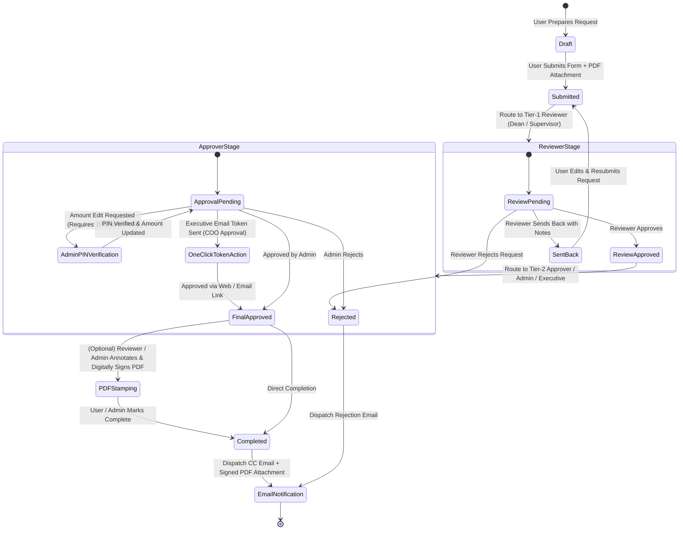

# SaaS Web App (FinalWebAPP) - Multi-Tier Request Submission & Approval Platform

[](https://flask.palletsprojects.com/)
[](https://flutter.dev/)
[](https://www.mysql.com/)
[](#-security--authentication-model)
[](https://www.xendit.co/)
[](LICENSE)

**SaaS Web App (FinalWebAPP)** is an enterprise-grade multi-tier request submission, workflow routing, approval management, and PDF digital signature platform. It combines a robust Python Flask backend, multi-role web dashboards (User, Reviewer/Dean, Admin, SuperAdmin, GSD, IT, SaaS Admin), an interactive browser-based PDF annotation system, a multi-tenant SaaS management suite with subscription payments (Xendit integration), and a cross-platform Flutter mobile client.

---

## 📋 Table of Contents
1. [🏗️ System Architecture](#️-system-architecture)
2. [🔄 Request Approval Workflow & State Machine](#-request-approval-workflow--state-machine)
3. [🛠️ Prerequisites & Environment Setup](#️-prerequisites--environment-setup)
4. [🚀 Running the Application](#-running-the-application)
5. [📡 API Endpoints & Reference](#-api-endpoints--reference)
6. [🔒 Security & Authentication Model](#-security--authentication-model)
7. [📂 Directory Structure & Component Matrix](#-directory-structure--component-matrix)
8. [🧪 Automated Testing & Performance Load Testing](#-automated-testing--performance-load-testing)
9. [📄 License](#-license)

---

## 🏗️ System Architecture

The platform follows a decoupled, multi-tier architecture powered by a centralized Python/Flask application server (`main.py`) communicating with a MySQL relational database, an SMTP email server, an in-browser PDF annotation engine, and a Flutter mobile app.

### High-Level Architecture Diagram

```mermaid
graph TD
    %% User Interfaces
    subgraph Frontend Tier
        WEB["🌐 Jinja2 Web Dashboards\n(User, Reviewer, Admin, GSD, IT, SaaS Admin)"]
        MOB["📱 Flutter Mobile App\n(moble/app - Android/iOS/Web)"]
        ANNOTATOR["✍️ Interactive PDF Annotator\n(annotate.html + PDF.js + Canvas)"]
    end

    %% Application Server
    subgraph Application Tier (Flask Core)
        MAIN["⚡ main.py\n(Flask App Core, Middleware, Routers, Security)"]
        CFG["⚙️ config.py\n(Env Config & DB Connection Pool)"]
        OTP["✉️ sendotp.py\n(OTP Service, Transactional Mailer & CC)"]
    end

    %% Data & External Services
    subgraph Data & External Services Tier
        DB[("🛢️ MySQL Database\n(users, requests, workflows, logs, saas)")]
        SMTP["📧 SMTP Server\n(OTP Issue, Notifications, Attachment Mailing)"]
        FS["📁 File Storage\n(Uploaded Attachments & Signed PDFs)"]
        XENDIT["💳 Xendit Payment Gateway\n(Subscriptions & Webhook Events)"]
    end

    %% Component Interconnections
    WEB -->|HTTP/HTTPS Session + CSRF| MAIN
    MOB -->|Bearer Token & REST JSON API| MAIN
    ANNOTATOR -->|Annotation JSON Payload| MAIN
    MAIN --> CFG
    CFG --> DB
    MAIN --> OTP
    OTP -->|Sends Emails & OTPs| SMTP
    MAIN -->|Reads / Writes SQL| DB
    MAIN -->|Reads / Writes Uploads & Signed PDFs| FS
    MAIN -->|Checkout & Webhooks| XENDIT
```

### Core Architecture Components

| Component | Architecture Role | Tech Stack / Protocol | Primary Responsibilities |
| :--- | :--- | :--- | :--- |
| **Flask Server (`main.py`)** | Application & API Gateway | Python 3.10+, Flask, Flask-Limiter, Argon2id | Main controller handling routes, session management, RBAC, PIN security, workflow routing, and PDF stamping. |
| **Database Pool (`config.py`)** | Data Persistence Layer | MySQL 8.0+, `mysql-connector-python` | Database connection management for request states, user credentials, workflow steps, audit logs, and SaaS billing. |
| **OTP & Mailer (`sendotp.py`)** | Communication Subsystem | Python `smtplib`, MIME Email, OTP logic | Generates 6-digit OTP codes, enforces cooldown timer, dispatches notification emails with signed PDF attachments. |
| **PDF Canvas Annotator** | Client Subsystem | HTML5 Canvas, PDF.js, PyMuPDF, ReportLab | Interactive document reviewer page where approvers highlight text, draw signatures, and burn stamps onto PDFs. |
| **Flutter Mobile App (`moble/`)** | Mobile Client Tier | Flutter 3.x / Dart, REST API | Mobile client for standard users to submit requests, view status updates, and manage profile notifications. |
| **Payment Gateway** | SaaS Billing Integrator | Xendit REST API & Webhooks | Handles recurring plan subscriptions, billing checkouts, and automatic tenant account status updates via webhooks. |

---

## 🔄 Request Approval Workflow & State Machine

Requests undergo a multi-tier review and approval lifecycle:



---

## 🛠️ Prerequisites & Environment Setup

### Prerequisites
Before starting, ensure you have the following software installed:
- **Python**: Version 3.10+
- **MySQL Server**: Version 8.0+
- **Flutter SDK**: Version 3.x (Required only for building/running the mobile app)
- **Git**: For cloning the repository

---

### Step 1: Clone Repository & Create Environment File

```bash
# Clone the repository
git clone https://github.com/your-username/SaasWebApp.git
cd SaasWebApp/SaaSWebApp

# Create environment configuration file from template
cp .env.example .env
```

---

### Step 2: Configure Environment Variables (`.env`)

Open `.env` in a text editor and update the fields:

```ini
# Application Runtime Configuration
FLASK_DEBUG=true
PORT=5000
SECRET_KEY=your-super-secret-production-key-here

# Database Configuration
DB_HOST=localhost
DB_PORT=3306
DB_USER=root
DB_PASSWORD=your_mysql_password
DB_NAME=sysdb

# Email / SMTP Credentials (Gmail, SendGrid, etc.)
email=your-system-email@gmail.com
pass=your-app-specific-password
SMTP_HOST=smtp.gmail.com
SMTP_PORT=587

# Security & Session Controls
SESSION_COOKIE_SAMESITE=Lax
SESSION_COOKIE_SECURE=false
PERMANENT_SESSION_LIFETIME=86400

# Rate Limiting Settings
RATE_LIMIT_DEFAULT_DAY=1000 per day
RATE_LIMIT_DEFAULT_HOUR=200 per hour
RATE_LIMIT_STORAGE_URI=memory://

# CORS Frontend Origins
FRONTEND_ORIGINS=http://localhost:3000,http://127.0.0.1:5000

# Payment Integration (Xendit)
XENDIT_SECRET_KEY=xnd_development_...
XENDIT_WEBHOOK_VERIFICATION_TOKEN=whsec_...
```

---

### Step 3: MySQL Database Initialization

1. Start your MySQL Server service.
2. Create the database schema:
   ```sql
   CREATE DATABASE IF NOT EXISTS sysdb CHARACTER SET utf8mb4 COLLATE utf8mb4_unicode_ci;
   ```
3. Runtime database tables and schema migrations (e.g. `users`, `requests`, `roles`, `departments`, `request_workflow_reviewers`, `contact_messages`, `system_runtime_settings`) are checked and initialized automatically by `main.py` on application startup.

---

### Step 4: Setup Python Backend Virtual Environment

```bash
# Navigate to the application root directory
cd SaaSWebApp

# Create a virtual environment
python -m venv .venv

# Activate the virtual environment
# On Windows (PowerShell / Command Prompt):
.venv\Scripts\activate

# On Linux / macOS:
source .venv/bin/activate

# Upgrade pip and install dependencies
pip install --upgrade pip
pip install -r requirements.txt
```

---

### Step 5: Setup Flutter Mobile Client (Optional)

```bash
cd SaaSWebApp/moble/app

# Download Flutter dependencies
flutter pub get

# Check attached devices / emulators
flutter devices

# Run Flutter mobile app
flutter run
```

---

### Step 6: Docker Deployment (Optional)

You can containerize and launch the Flask application using Docker:

```bash
cd SaaSWebApp

# Build the Docker image
docker build -t saas-webapp:latest .

# Run the container mapping port 5000
docker run -d --name saas_app -p 5000:5000 --env-file .env saas-webapp:latest
```

---

## 🚀 Running the Application

### 1. Launching the Backend Server

With your virtual environment activated:

```bash
cd SaaSWebApp
python main.py
```

The application server will boot up at `http://127.0.0.1:5000`.

### 2. Initial Administrative Logins

Upon first launch, you can access the web application by navigating to `http://127.0.0.1:5000/login`.
- **System Web Portal**: `/login`
- **IT Management Portal**: `/IT`
- **SaaS SuperAdmin Management**: `/saas-admin`

---

## 📡 API Endpoints & Reference

### 1. Web Page Routes & Dashboards

| Route | Method | Access Level | Description |
| :--- | :--- | :--- | :--- |
| `/` | `GET` | Public | Root landing page / redirect handler |
| `/login` | `GET`, `POST` | Public | User authentication page & login form |
| `/signup` | `GET`, `POST` | Public | User self-registration with OTP verification |
| `/forgot-password` | `GET`, `POST` | Public | Password reset request form |
| `/reset-password/<token>`| `GET`, `POST` | Public | Token-validated password reset form |
| `/udashboard` | `GET` | User | End-user dashboard for submitting & tracking requests |
| `/dean` | `GET` | Reviewer/Dean | Tier-1 reviewer approval queue dashboard |
| `/admin` | `GET` | Admin / Exec | Tier-2 approver dashboard & request manager |
| `/gsd_dashboard` | `GET` | GSD | General Services Division shipment & copy tracking |
| `/IT` | `GET` | IT Admin | User management, department & position setup |
| `/saas-admin` | `GET` | SuperAdmin | SaaS multi-tenant tenant management & billing analytics |
| `/annotate/<request_id>`| `GET` | Reviewer/Admin | Browser-based interactive PDF annotation canvas |
| `/logout` | `GET` | Authenticated | Clears user session and logs out |

---

### 2. Authentication & Security APIs

| Endpoint | Method | Payload | Description |
| :--- | :--- | :--- | :--- |
| `/send-otp` | `POST` | `{ "email": "user@example.com" }` | Issues 6-digit OTP code with cooldown check |
| `/verify` | `POST` | `{ "email": "...", "otp": "123456" }` | Validates submitted OTP code |
| `/change_password` | `POST` | `{ "old_password": "...", "new_password": "..." }` | Change password for logged-in user |
| `/api/admin/pin/status` | `GET` | None | Returns Admin 2FA PIN setup status |
| `/api/admin/pin/setup` | `POST` | `{ "pin": "1234" }` | Configures initial Admin security PIN |
| `/api/admin/pin/request-otp`| `POST` | None | Sends verification OTP to admin email for PIN actions |
| `/api/admin/pin/verify-otp` | `POST` | `{ "otp": "..." }` | Verifies OTP for PIN management |
| `/api/admin/pin/change` | `POST` | `{ "old_pin": "...", "new_pin": "..." }` | Changes existing Admin PIN |

---

### 3. Request Submission & Workflow Approval APIs

| Endpoint | Method | Description |
| :--- | :--- | :--- |
| `/create_request` | `POST` | Submits new request with PDF attachment & monetary amount |
| `/api/user_dashboard` | `GET` | Fetches dashboard stats & submitted requests for logged-in user |
| `/api/requests` | `GET`, `POST` | Queries or creates requests |
| `/api/request/<id>/status` | `POST` | Updates request status (`Approved`, `Rejected`, `SentBack`) |
| `/api/request/<id>/amount` | `POST` | Updates request amount (**Requires Admin PIN verification**) |
| `/api/request/<id>/workflow` | `GET`, `POST` | Fetches or updates multi-stage reviewer routing |
| `/api/request/<id>/send-back` | `POST` | Sends request back to applicant with correction notes |
| `/api/request/<id>/complete` | `POST` | Marks request as completed and triggers notification dispatches |
| `/api/request/<id>/cc` | `POST` | Dispatches CC email with signed attachment to extra recipients |

---

### 4. Executive One-Click Token Approval APIs

| Endpoint | Method | Description |
| :--- | :--- | :--- |
| `/coo-action/<token>` | `GET` | Renders token-secured executive approval action page |
| `/coo-action/<token>/attachment` | `GET` | Securely views attachment associated with executive token |
| `/api/coo-action/<token>/approve` | `POST` | Executes one-click approval via email token |
| `/api/coo-action/<token>/reject` | `POST` | Executes one-click rejection via email token |

---

### 5. PDF Digital Signature & Annotation APIs

| Endpoint | Method | Description |
| :--- | :--- | :--- |
| `/api/request/<id>/annotations` | `GET`, `POST` | Retrieves or saves raw JSON annotation vectors |
| `/api/request/<id>/annotate` | `POST` | Merges annotations & signatures into PDF to generate signed copy |
| `/download_attachment/<id>` | `GET` | Downloads uploaded request attachment PDF |

---

### 6. SaaS Multi-Tenancy & Subscriptions (Xendit Integration)

| Endpoint | Method | Description |
| :--- | :--- | :--- |
| `/subscribe` | `GET` | Subscription checkout landing page |
| `/api/xendit/checkout` | `POST` | Initializes Xendit payment checkout session |
| `/api/xendit/webhook` | `POST` | Xendit webhook listener for payment verification |
| `/api/saas/companies` | `GET` | Returns list of registered SaaS tenant companies |
| `/api/saas/companies/<id>/status` | `POST` | Updates tenant company status (`Active`/`Suspended`) |
| `/api/saas/subscription/plans` | `GET` | Returns available subscription plans |
| `/api/saas/subscription/assign` | `POST` | Assigns subscription plan to tenant company |
| `/api/saas/analytics` | `GET` | Retrieves SaaS revenue, subscription counts & tenant analytics |

---

### 7. Flutter Mobile Client APIs (`/api/mobile/*`)

| Endpoint | Method | Description |
| :--- | :--- | :--- |
| `/api/mobile/departments` | `GET` | Returns active departments list |
| `/api/mobile/send-otp` | `POST` | Dispatches signup OTP code for mobile client |
| `/api/mobile/verify-otp` | `POST` | Validates mobile signup OTP code |
| `/api/mobile/signup` | `POST` | Registers new user from Flutter mobile app |
| `/api/mobile/login` | `POST` | Authenticates mobile user and returns Bearer token |
| `/api/mobile/user-profile` | `GET` | Fetches mobile user profile data |
| `/api/mobile/requests` | `GET` | Fetches mobile user requests list & live statuses |
| `/api/mobile/notifications` | `GET` | Fetches user notifications for mobile client |

---

## 🔒 Security & Authentication Model

1. **Dual Authentication Scheme**:
   - **Web Application**: HTTP-Only, SameSite (`Lax`), Secure session cookies paired with `Flask-WTF` CSRF token protection on all state-modifying POST routes.
   - **Mobile Client**: Bearer token authentication stored securely on device via `shared_preferences`.
2. **Password Cryptography**: Password storage powered by **Argon2id** hashing (via Werkzeug/Argon2) with dynamic salt generation and automatic hash upgrade on login.
3. **Admin PIN & 2-Factor Action Authorization**:
   - Sensitive operations (such as modifying monetary values on active requests) require an Admin PIN.
   - PIN setup and modifications require email-based OTP 2FA.
4. **File Upload Security**:
   - Enforces strict file size limits (20MB maximum).
   - Validates MIME type, file extension, and inspects PDF binary headers (`%PDF-`) to prevent shell upload attacks.
5. **Rate Limiting**: Integrated `Flask-Limiter` with storage backend to prevent brute-force attacks on auth endpoints (`/login`, `/send-otp`, `/verify`).
6. **HTTP Security Headers**: Global response middleware injects:
   - `X-Content-Type-Options: nosniff`
   - `X-Frame-Options: DENY`
   - `Referrer-Policy: strict-origin-when-cross-origin`
   - `Content-Security-Policy (CSP)`

---

## 📂 Directory Structure & Component Matrix

```
SaasWebApp/
├── LICENSE                            # MIT License File
├── requirements.txt                   # Backend Python Dependencies
├── README.md                          # Root Project Documentation
└── SaaSWebApp/                        # Main Application Root
    ├── main.py                        # Monolithic Flask Server Core & API Handlers
    ├── config.py                      # Database Connection Factory & Env Loader
    ├── sendotp.py                     # OTP Service, Mailer & Attachment Dispatcher
    ├── Dockerfile                     # Docker Deployment Configuration
    ├── .env.example                   # Environment Variables Template
    ├── locustfile.py                  # Locust Load Testing Suite
    ├── requirements.txt               # Backend Python Dependencies
    │
    ├── docs/                          # Architecture & Developer Documentation
    │   ├── SYSTEM_DOCUMENTATION.md    # Detailed Specification Document
    │   └── FILE_INDEX.md              # Codebase Mapping & Component Roles
    │
    ├── templates/                     # Jinja2 HTML Frontends
    │   ├── login.html                 # Login Page Template
    │   ├── signup.html                # Signup Page with OTP Modal
    │   ├── user.html                  # User Request Dashboard Template
    │   ├── dean.html                  # Reviewer / Dean Approval Queue Template
    │   ├── admin.html                 # Admin Dashboard & Workflow Manager
    │   ├── gsddashboard.html          # GSD Shipment & Material Tracking
    │   ├── IT.html                    # IT Administration Portal
    │   ├── annotate.html              # PDF Annotation & Digital Signature Page
    │   └── saas_admin.html            # SaaS SuperAdmin Management Dashboard
    │
    ├── static/                        # Web Static Assets (JS, CSS, Fonts)
    │   ├── admin/                     # Admin Dashboard Scripts & Styles
    │   ├── dean/                      # Dean Dashboard Scripts & Styles
    │   ├── gsd/                       # GSD Dashboard Scripts & Styles
    │   ├── user/                      # User Dashboard Scripts & Styles
    │   ├── alltoast/                  # Global Toast Notification Utility
    │   └── pdf.min.js                 # Browser-side PDF Renderer Engine
    │
    ├── moble/                         # Mobile Client Workspace
    │   └── app/                       # Flutter Cross-Platform Client
    │       ├── pubspec.yaml           # Flutter Dependencies
    │       └── lib/                   # Dart Client Source Code
    │           ├── main.dart          # Mobile Entrypoint & Session Router
    │           ├── login_page.dart    # Mobile Auth & OTP Screen
    │           ├── homepage.dart      # Navigation Shell & Tab Views
    │           └── api_service.dart   # REST API Client for Flask Backend
    │
    └── tests/                         # Automated Testing Workspace
        ├── conftest.py                # Pytest App Setup & Fixtures
        └── test_app.py                # Unit & Integration Tests
```

---

## 🧪 Automated Testing & Performance Load Testing

### Running Automated Unit Tests
To run the `pytest` test suite:

```bash
cd SaaSWebApp
pytest
```

---

### Running Performance Load Testing
To run performance load tests with `Locust`:

```bash
cd SaaSWebApp
locust -f locustfile.py --host=http://localhost:5000
```

Open `http://localhost:8089` in your web browser to start sending simulated traffic to the server.

---

## 📄 License

This project is licensed under the [MIT License](LICENSE).